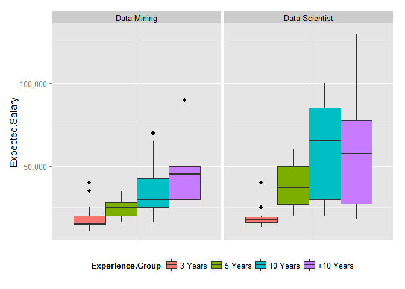
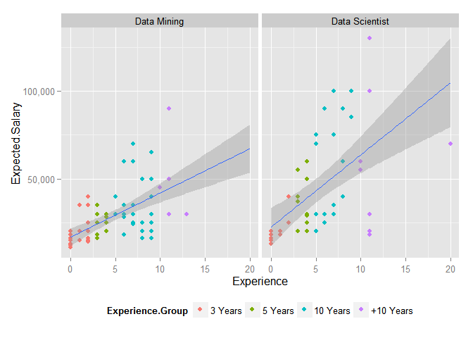
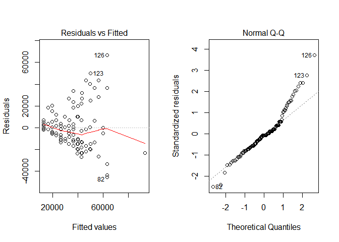
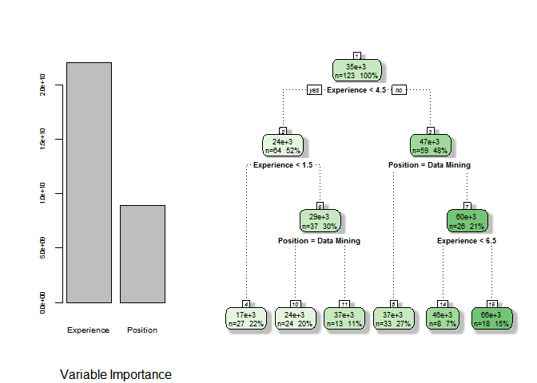

Adrian Cuyugan  

# Motivation

As I am going back to the Philippines to pursue further studies in Statistics, it intrigues me if Data Mining and Data Science are catching up. I am seeing some positions in jobsearch websites such as Jobstreet so as a data miner, I extracted the relevant job openings that are related to the key phrases:
* __Data Mining__; and
* __Data Scientist__.

These may look too specific but this is just a quick draft, anyway. Also, I did not include __Data Analyst__ as this scopes a broader job scope diversity than the two mentioned not perform any intensive text extraction from Jobstreet.

**Warning:** The result of the models should not be used to provide recommendations as data the is collected using a convenience sample without performing accuracy tests, only k-fold cross validations against the training set when CART is used.

# Data set

The data is collected manually by searching for relevant job openings active today, 22 May, 2015. I have an assumption that that the data set is relatively small, and so less than 30 positions returned. Pre-processing is done externally, in Excel, to remove currency prefix, *i.e.* PHP and text in experience, etc.


```r
library(RCurl)
jobstreet <- getURL("https://raw.githubusercontent.com/foxyreign/Adhocs/master/Jobstreet.csv", ssl.verifypeer=0L, followlocation=1L) # Load dataset
writeLines(jobstreet, "Jobstreet.csv")
df <- read.csv('Jobstreet.csv', head=T, sep=",") # Load dataset
df <- na.omit(df) # Exclude missing data

summary(df) # Summarize
```

```
##  Expected.Salary    Experience       Education    
##  Min.   : 11000   Min.   : 0.000   Min.   :1.000  
##  1st Qu.: 19000   1st Qu.: 2.000   1st Qu.:2.000  
##  Median : 28000   Median : 4.000   Median :2.000  
##  Mean   : 35016   Mean   : 4.919   Mean   :2.179  
##  3rd Qu.: 40000   3rd Qu.: 8.000   3rd Qu.:2.000  
##  Max.   :130000   Max.   :20.000   Max.   :4.000  
##                                                   
##                  Specialization           Position 
##  IT-Software            :30     Data Mining   :72  
##  -                      :17     Data Scientist:51  
##  IT-Network/Sys/DB Admin:14                        
##  Actuarial/Statistics   :12                        
##  Banking/Financial      : 8                        
##  Electronics            : 8                        
##  (Other)                :34
```

As mentioned, there are only approximately 120 job applicants which applied for these two grouped positions. Since the data does not mention if an applicant applied for more than one position, I assume that these are distinct records of applicants per position and/or position group, Data Mining and Data Scientist.

## Variables

1. **Expected.Salary** - numerical. The expected salary of each applicant based on their profile.
2. **Experience** - ordinal but treated as numerical for easier interpretation in the later algorithms used. This is the years of work experience of the applicant.
4. **Education** - categorical; not used in the models because of extreme unbalance in proportions. This is labelled as:
  * 1 - Secondary School
  * 2 - Bachelor Degree
  * 3 - Post Graduate Diploma
  * 4 - Professional Degree
3. **Specialization** - categorical; not used in this analysis. 
4. **Position** - categorical. Data Mining or Data Scientist
5. **Education.Group** - categorical. Additional variable to bin the years of experience.


```r
# Categorize education variable
df$Education <- factor(df$Education, levels = c(1,2,3,4), 
                       labels=(c("Secondary Sch", "Bach Degree", 
                                 "Post Grad Dip", "Prof Degree")))

# Bin years of experience
df$Experience.Group <- ifelse(df$Experience < 3, "3 Years", 
                              ifelse(df$Experience < 5, "5 Years",
                                     ifelse(df$Experience < 10, "10 Years", "+10 Years")))
df$Experience.Group <- factor(df$Experience.Group, 
                              levels=c("3 Years", "5 Years", "10 Years", "+10 Years"))

# Drop variables
df <- df[, !(colnames(df) %in% c("Education","Specialization"))]

# Subsets positions
mining <- subset(df, Position == "Data Mining")
scientist <- subset(df, Position == "Data Scientist")
```

# Distribution

As expected, Data Scientists have a higher expected salary although this is so dispersed that even if I compare these two using a t-test assuming heterodastic distribution, there is a significant difference between the averages expected salaries of the two positions. 


```r
require(ggplot2)
require(scales)

# Boxplot
ggplot(df, aes(x=factor(0), y=Expected.Salary, fill=Experience.Group)) + 
  facet_wrap(~Position) + geom_boxplot() + xlab(NULL) + 
  scale_y_continuous(labels = comma) + 
  theme(axis.title.x=element_blank(),
        axis.text.x=element_blank(),
        axis.ticks.x=element_blank(),
        legend.position="bottom")
```

<<<<<<< HEAD
 
=======

>>>>>>> b0a1a51cfa0b64d410ce9a86ff915fe96bbf75ad

```r
# T-test
t.test(Expected.Salary ~ Position, paired = FALSE, data = df)
```

```
## 
## 	Welch Two Sample t-test
## 
## data:  Expected.Salary by Position
## t = -3.3801, df = 68.611, p-value = 0.001199
## alternative hypothesis: true difference in means is not equal to 0
## 95 percent confidence interval:
##  -24086.501  -6205.983
## sample estimates:
##    mean in group Data Mining mean in group Data Scientist 
##                     28736.11                     43882.35
```


```r
# Median expected salaries of Data Mining vs Data Scientist
c(median(mining$Expected.Salary), median(scientist$Expected.Salary))
```

```
## [1] 25000 30000
```

Come on fellow data enthusiasts, you should do better than this! The difference of their medians is just 5,000 PHP. In my honest, these center values are way below based on the prospective demand of shortage of these people in the next 10 years.

# Regression

The intercept is not included in the model because I want to see the contrast between Data Mining and Data Scientist although I already computed it beforehand. Besides, though the linear regressio model shows significant value $r_{adj}^{2}>0.80, p<0.05$ but when doing diagnostics, linear approach is not appropriate because the data is not random and depicts a funnel shape based on their errors.

The regression output coefficients are interpreted as follows:
$$y = \beta_{0}(12,934.9) + \beta_{1}(3,336.3) + \beta_{2}$$


```r
# Estimate coefficients of linear regression model
summary(lm(Expected.Salary ~ Experience + Position-1, data=df))
```

```
## 
## Call:
## lm(formula = Expected.Salary ~ Experience + Position - 1, data = df)
## 
## Residuals:
##    Min     1Q Median     3Q    Max 
## -45312 -11123  -1280   6877  66688 
## 
## Coefficients:
##                        Estimate Std. Error t value Pr(>|t|)    
## Experience               3336.3      446.3   7.476 1.38e-11 ***
## PositionData Mining     12934.9     3024.3   4.277 3.83e-05 ***
## PositionData Scientist  26612.0     3455.8   7.701 4.27e-12 ***
## ---
## Signif. codes:  0 '***' 0.001 '**' 0.01 '*' 0.05 '.' 0.1 ' ' 1
## 
## Residual standard error: 18350 on 120 degrees of freedom
## Multiple R-squared:  0.8136,	Adjusted R-squared:  0.809 
## F-statistic: 174.6 on 3 and 120 DF,  p-value: < 2.2e-16
```

```r
# Scatter plot
ggplot(df, aes(x=Experience, y=Expected.Salary)) + 
  geom_point(aes(col=Experience.Group)) + 
  facet_wrap(~Position) + 
  scale_y_continuous(labels = comma) + 
  stat_smooth(method="lm", fullrange = T) + 
  theme(legend.position="bottom")
```

<<<<<<< HEAD
 
=======

>>>>>>> b0a1a51cfa0b64d410ce9a86ff915fe96bbf75ad

```r
# Diagnose LM
par(mfrow=c(1,2))
plot(lm(Expected.Salary ~ Experience + Position-1, data=df), c(1,2))
```

<<<<<<< HEAD
 
=======

>>>>>>> b0a1a51cfa0b64d410ce9a86ff915fe96bbf75ad

# CART

Information Gain is used to divide the nodes based on weighted average entropy as linear regression does not do well with the data set. Of course, years of experience is more influential than the position. 

Looking at the estimated salaries from the printed tree, applicants who have years of experience lower than 1.5 are approximately expecting 17,000 PHP. While does that applied for Data Mining jobs with 6.5 years of experience are expecting 66,000 pesos.


```r
require(rpart)
require(rattle)

cart <- rpart(formula = Expected.Salary ~ Experience + Position, 
              data = df, 
              parms = list(split = "information"), # Uses information gain
              model = T) # Retains model information

# Plot tree
layout(matrix(c(1,2,3,4), nrow = 1, ncol = 2, byrow = TRUE), widths=c(1.5,2.5)) 
barplot(cart$variable.importance, 
        cex.names = 0.6, cex.axis = 0.5,
        sub = "Variable Importance") 
fancyRpartPlot(cart, main=NULL, sub=NULL)
```

<<<<<<< HEAD
 
=======

>>>>>>> b0a1a51cfa0b64d410ce9a86ff915fe96bbf75ad

```r
# Estimates
print(cart); printcp(cart)
```

```
## n= 123 
## 
## node), split, n, deviance, yval
##       * denotes terminal node
## 
##  1) root 123 66101970000 35016.26  
##    2) Experience< 4.5 64  7326938000 23781.25  
##      4) Experience< 1.5 27   520666700 16888.89 *
##      5) Experience>=1.5 37  4587676000 28810.81  
##       10) Position=Data Mining 24  1055625000 24375.00 *
##       11) Position=Data Scientist 13  2188000000 37000.00 *
##    3) Experience>=4.5 59 41933560000 47203.39  
##      6) Position=Data Mining 33  9501333000 37333.33 *
##      7) Position=Data Scientist 26 25137120000 59730.77  
##       14) Experience< 6.5 8  5237500000 46250.00 *
##       15) Experience>=6.5 18 17799610000 65722.22 *
```

```
## 
## Regression tree:
## rpart(formula = Expected.Salary ~ Experience + Position, data = df, 
##     model = T, parms = list(split = "information"))
## 
## Variables actually used in tree construction:
## [1] Experience Position  
## 
## Root node error: 6.6102e+10/123 = 537414370
## 
## n= 123 
## 
##         CP nsplit rel error  xerror    xstd
## 1 0.254780      0   1.00000 1.00888 0.19245
## 2 0.110361      1   0.74522 0.81057 0.14709
## 3 0.033563      2   0.63486 0.77285 0.13292
## 4 0.031769      3   0.60130 0.76228 0.13052
## 5 0.020333      4   0.56953 0.74207 0.12969
## 6 0.010000      5   0.54919 0.70258 0.12366
```

Again, fellow data miners and data scientists, ask for more! You do not realize your worth with the current demand of people who can understand data.

# Appendix

## Data Mining

```
##    Expected.Salary Experience    Position Experience.Group
## 1            60000          6 Data Mining         10 Years
## 2            16000          9 Data Mining         10 Years
## 3            18000          3 Data Mining          5 Years
## 4            20000          0 Data Mining          3 Years
## 5            20000          4 Data Mining          5 Years
## 6            20000          8 Data Mining         10 Years
## 7            25000          4 Data Mining          5 Years
## 8            30000          3 Data Mining          5 Years
## 9            30000          5 Data Mining         10 Years
## 10           35000          6 Data Mining         10 Years
## 11           40000          2 Data Mining          3 Years
## 12           40000          5 Data Mining         10 Years
## 13           40000          5 Data Mining         10 Years
## 14           40000          9 Data Mining         10 Years
## 15           50000          8 Data Mining         10 Years
## 16           50000          9 Data Mining         10 Years
## 17           50000         11 Data Mining        +10 Years
## 18           60000          7 Data Mining         10 Years
## 19           65000          9 Data Mining         10 Years
## 20           70000          7 Data Mining         10 Years
## 21           12000          0 Data Mining          3 Years
## 22           13000          0 Data Mining          3 Years
## 23           15000          0 Data Mining          3 Years
## 24           15000          1 Data Mining          3 Years
## 25           16000          0 Data Mining          3 Years
## 26           20000          1 Data Mining          3 Years
## 27           20000          1 Data Mining          3 Years
## 28           20000          2 Data Mining          3 Years
## 29           20000          4 Data Mining          5 Years
## 30           25000          2 Data Mining          3 Years
## 31           25000          4 Data Mining          5 Years
## 32           25000          4 Data Mining          5 Years
## 33           25000          4 Data Mining          5 Years
## 34           25000          8 Data Mining         10 Years
## 35           25000          8 Data Mining         10 Years
## 36           28000          4 Data Mining          5 Years
## 37           28000          6 Data Mining         10 Years
## 38           30000          4 Data Mining          5 Years
## 39           30000          6 Data Mining         10 Years
## 40           30000          9 Data Mining         10 Years
## 41           30000         13 Data Mining        +10 Years
## 42           35000          1 Data Mining          3 Years
## 43           35000          2 Data Mining          3 Years
## 44           35000          3 Data Mining          5 Years
## 45           35000          7 Data Mining         10 Years
## 46           45000         10 Data Mining        +10 Years
## 47           50000          9 Data Mining         10 Years
## 50           11000          0 Data Mining          3 Years
## 51           12000          0 Data Mining          3 Years
## 52           14000          2 Data Mining          3 Years
## 53           15000          0 Data Mining          3 Years
## 54           15000          1 Data Mining          3 Years
## 55           15000          1 Data Mining          3 Years
## 56           15000          2 Data Mining          3 Years
## 57           16000          2 Data Mining          3 Years
## 58           16000          3 Data Mining          5 Years
## 59           16000          8 Data Mining         10 Years
## 60           18000          0 Data Mining          3 Years
## 61           18000          3 Data Mining          5 Years
## 62           18000          6 Data Mining         10 Years
## 63           20000          9 Data Mining         10 Years
## 64           24000          7 Data Mining         10 Years
## 65           25000          3 Data Mining          5 Years
## 66           25000          3 Data Mining          5 Years
## 67           25000          3 Data Mining          5 Years
## 68           25000          7 Data Mining         10 Years
## 69           25000          9 Data Mining         10 Years
## 70           30000          4 Data Mining          5 Years
## 71           30000          6 Data Mining         10 Years
## 72           30000          7 Data Mining         10 Years
## 73           30000         11 Data Mining        +10 Years
## 74           90000         11 Data Mining        +10 Years
```

## Data Scientist

```
##     Expected.Salary Experience       Position Experience.Group
## 75            13000          0 Data Scientist          3 Years
## 76            15000          0 Data Scientist          3 Years
## 77            16000          0 Data Scientist          3 Years
## 78            16000          0 Data Scientist          3 Years
## 79            18000          0 Data Scientist          3 Years
## 80            18000          0 Data Scientist          3 Years
## 81            18000          1 Data Scientist          3 Years
## 82            18000         11 Data Scientist        +10 Years
## 83            20000          0 Data Scientist          3 Years
## 84            20000          1 Data Scientist          3 Years
## 85            20000         11 Data Scientist        +10 Years
## 86            29000          4 Data Scientist          5 Years
## 87            30000          5 Data Scientist         10 Years
## 88            30000          7 Data Scientist         10 Years
## 90            16000          0 Data Scientist          3 Years
## 91            16000          0 Data Scientist          3 Years
## 92            18000          0 Data Scientist          3 Years
## 93            20000          3 Data Scientist          5 Years
## 94            20000          4 Data Scientist          5 Years
## 95            20000          5 Data Scientist         10 Years
## 96            25000          2 Data Scientist          3 Years
## 97            25000          4 Data Scientist          5 Years
## 98            25000          6 Data Scientist         10 Years
## 99            30000          4 Data Scientist          5 Years
## 100           30000          6 Data Scientist         10 Years
## 101           30000          6 Data Scientist         10 Years
## 102           30000         11 Data Scientist        +10 Years
## 103           35000          7 Data Scientist         10 Years
## 104           37000          3 Data Scientist          5 Years
## 105           40000          2 Data Scientist          3 Years
## 106           40000          3 Data Scientist          5 Years
## 107           40000          8 Data Scientist         10 Years
## 108           50000          4 Data Scientist          5 Years
## 109           50000          4 Data Scientist          5 Years
## 110           55000          3 Data Scientist          5 Years
## 111           55000         10 Data Scientist        +10 Years
## 112           60000          4 Data Scientist          5 Years
## 113           60000          8 Data Scientist         10 Years
## 114           60000         10 Data Scientist        +10 Years
## 115           70000          5 Data Scientist         10 Years
## 116           70000         20 Data Scientist        +10 Years
## 117           75000          5 Data Scientist         10 Years
## 118           75000          7 Data Scientist         10 Years
## 119           85000          9 Data Scientist         10 Years
## 120           85000          9 Data Scientist         10 Years
## 121           90000          6 Data Scientist         10 Years
## 122           90000          8 Data Scientist         10 Years
## 123          100000          7 Data Scientist         10 Years
## 124          100000          9 Data Scientist         10 Years
## 125          100000         11 Data Scientist        +10 Years
## 126          130000         11 Data Scientist        +10 Years
```
